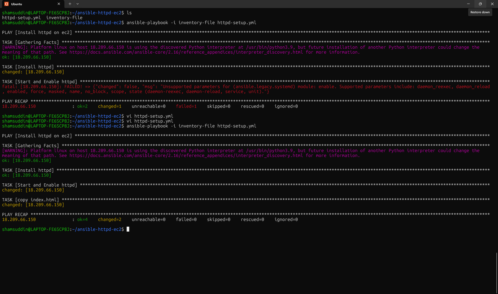

# 🧩 Ansible Apache Web Server Automation on AWS EC2

This mini DevOps project uses **Ansible** to automate the installation of the **Apache Web Server** on an **AWS EC2** instance.

## 🚀 What This Playbook Does

- Connects to a remote EC2 instance via SSH
- Installs Apache (`httpd`)
- Starts and enables the Apache service
- Deploys a custom HTML index page
- Automates the entire server setup using a simple Ansible playbook

## 🛠️ Technologies Used

- Ansible
- AWS EC2
- YAML
- SSH

## 📸 Screenshots

### ✅ Playbook Run Success:


### 🌐 Apache Page in Browser:


## 📁 Files in this Repo

- `inventory-file` — contains the EC2 public IP
- `httpd-setup.yml` — the Ansible playbook to install & configure Apache
- `index.html` — simple web page to be deployed
- Screenshots for documentation

## 🧠 Key Learning

This project demonstrates the power of **Infrastructure Automation**. With just a few lines of YAML and one command, we can provision and configure a working web server — fast and repeatable!

## 📌 How to Use

1. Replace your EC2 IP in the `inventory` file
2. Ensure your EC2 instance allows port 22 (SSH) and 80 (HTTP)
3. Run the playbook using:

```bash
ansible-playbook -i inventory apache_setup.yml

